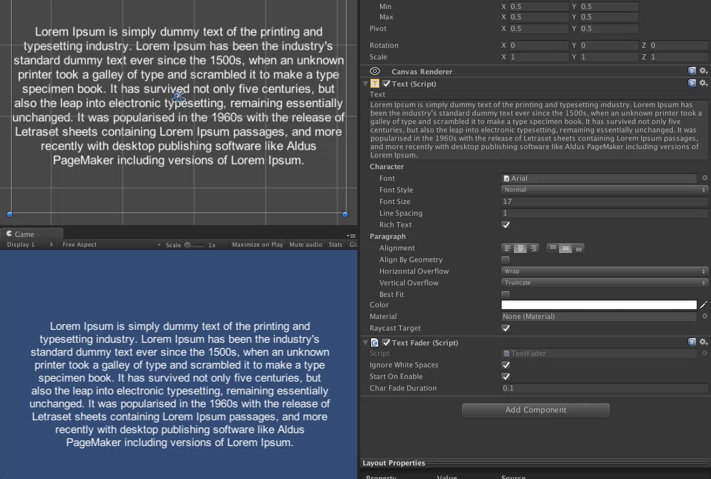

# TextFader

Add a beautiful char-by-char fade in animation to your texts by just adding a simple script. 

0 runtime performance implications and 0 gc allocs.

##Usage

Add the `TextFader` script to your `Text` element. You can set it to automatically start when enabled, or you can start it yourself by invoking its `PerformAnimation` method.